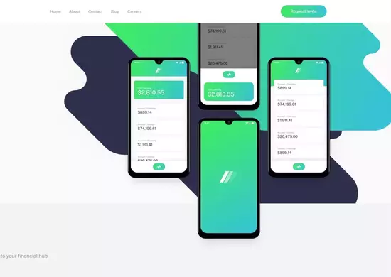

# Frontend Mentor - Easybank landing page solution

This is my solution to the [Easybank landing page](https://www.frontendmentor.io/challenges/easybank-landing-page-WaUhkoDN) challenge on [Frontend Mentor](https://www.frontendmentor.io/).


## Table of contents

- [Overview](#overview)
  - [The challenge](#the-challenge)
  <!-- - [Screenshot](#screenshot) -->
  - [Links](#links)
- [My process](#my-process)
  - [Built with](#built-with)
  - [What I learned](#what-i-learned)
  - [Continued development](#continued-development)
  - [Useful resources](#useful-resources)
- [Author](#author)
<!-- - [Acknowledgments](#acknowledgments) -->

## Overview

### The challenge

Users should be able to:

- View the optimal layout for the site depending on their device's screen size
- Change to mobile version with a click
- See hover states for all interactive elements on the page

<!-- ### Screenshot


Add a screenshot of your solution. The easiest way to do this is to use Firefox to view your project, right-click the page and select "Take a Screenshot". You can choose either a full-height screenshot or a cropped one based on how long the page is. If it's very long, it might be best to crop it.

Alternatively, you can use a tool like [FireShot](https://getfireshot.com/) to take the screenshot. FireShot has a free option, so you don't need to purchase it. 

Then crop/optimize/edit your image however you like, add it to your project, and update the file path in the image above.
-->
### Links

- Solution URL: [Easybank ChalLenge](https://gbellos.github.io/easybank-challenge/)
 
## My process

### Built with

- [VS Code](https://code.visualstudio.com/)
- Semantic HTML5 markup
- CSS custom properties
- Flexbox
- CSS Grid
<!-- - Mobile-first workflow
- [React](https://reactjs.org/) - JS library
- [Next.js](https://nextjs.org/) - React framework
- [Styled Components](https://styled-components.com/) - For styles -->

### What I learned

My biggest learning was about the usage of flex. Without using javascript, I found that the best way to make a dynamic responsiveness with flex was using more divs and spans in the HTML code.

For example, I used a span tag together with the img tag in an extra flex div container (div.container) to force the image to the right when the size of the div.container is the default size (--fixed-size-1).

When we reduce the size of the viewport and the div.container shrinks, the space between the span and the img tag gets smaller until it reaches 0. After that, as the width of div.container gets smaller than the image width, the image is now fixed to the left side and the width leftovers are just moved out of the section container (section.container). That's a mechanic that only flex could make so simple.



```html
<section class="container">
  <div class="image">
    <div class="container">
      <span></span>
      
    </div>
  </div>

  <div class="text">
    ...
  </div>
</section>
```
```css
section.container
{
    display: flex;
    justify-content: space-between;
    align-items: center;
}
.image
{
    order: 1;
    position: relative;

    width: var(--fixed-size-1);
    align-self: stretch;
    
    margin-left: 20px;
}
div.container
{
    position: absolute;
    width: 100%;

    display: flex;
    justify-content: space-between;
}
div.container>img
{
    width: 767px;
    height: auto;
    
    padding-left: 175px;
    padding-right: var(--fixed-size-2);
}
```

We can note that combined with it, the section.container is also flexed and there is space around the .image and the .text containers that gets smaller when the viewport is reduced. My goal with it all was to make the background of the cellphones picture centered with it when the viewport is big, but sticked to the left (as in the [proposed design](design/desktop-design.jpg)) when it is small, with a nice dynamic responsiveness.

Obs.: The reason why I use another div (the div.container) to flex the image with the span tag and not the .image is that the image should be absolute positioned so the height of the section.container wasn't influenced by its size and its vertical leftovers were in front of the section below (the one with the "Why choose Easybank?" header).

### Continued development
<!-- ### Next steps -->

Possibly add some parallax effects in the future.

### Useful resources

- [Previewer app](previewer/previewer.html) - I made this app to help me visualize all the svg files.

## Author

<!-- - Website - [Add your name here](https://www.your-site.com) -->
- Frontend Mentor - [@gbellos](https://www.frontendmentor.io/profile/GBelloS)
- Twitter - [@gbeiios](https://www.twitter.com/GBeIIoS)

<!-- ## Acknowledgments

This is where you can give a hat tip to anyone who helped you out on this project. Perhaps you worked in a team or got some inspiration from someone else's solution. This is the perfect place to give them some credit.
 -->
